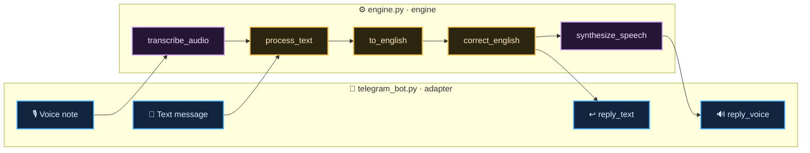

<div align="center">

# 🌐 Lang Helper Bot

### Correct your English &nbsp;·&nbsp; Translate Hindi &amp; Hinglish &nbsp;·&nbsp; by text or voice


</div>

<p align="center">
  <i>Send it a message and it replies corrected. Send it a voice note and it talks back.</i>
</p>

---

## ✨ Features

<table>
<tr>
<td width="50%" valign="top">

### 📝 &nbsp;Corrects English
Fixes grammar, spelling, and clunky phrasing — returns clean, natural text.

### 🔁 &nbsp;Translates to English
Hindi, **Hinglish** (Roman script), or plain English all come back as polished English.

</td>
<td width="50%" valign="top">

### 🎙️ &nbsp;Understands voice notes
Transcribes what you said, runs it through the engine, and **replies with a voice note**.

### 🧩 &nbsp;Reusable core
All language logic lives in one platform-agnostic file — ready to power WhatsApp or a web app next.

</td>
</tr>
</table>

---

## 🛠 Built with

<div align="center">


<br/><br/>


</div>

| Job | Tool | Notes |
| :-- | :-- | :-- |
| 🤖 &nbsp;Bot framework | **python-telegram-bot** | webhook mode for deployment |
| 🌍 &nbsp;Translation | **deep-translator** (Google) | auto-detect → English · **no key** |
| ✍️ &nbsp;Grammar correction | **Groq** (Llama 3.3 70B) | hosted, fast |
| 🎧 &nbsp;Speech → text | **Gladia** | hosted transcription |
| 🗣️ &nbsp;Text → speech | **gTTS** | Google Text-to-Speech |

> 💡 &nbsp;No local ML models and no system dependencies — the bot is a lightweight script, so hosting stays cheap and simple.

---

## 🔧 How it works

Two files, one clean split: the **adapter** only talks to Telegram, the **engine** only does language work. Text and voice funnel into the *same* engine call.



**In words:** a message (or transcribed voice) enters `process_text` → `to_english` auto-detects and converts Hindi / Hinglish / English to English → `correct_english` polishes the grammar → the result is sent back as text, or spoken back as a voice note.

---

## 📁 Project structure

```
Lang_Helper/
├── 📄 telegram_bot.py     # adapter — all Telegram I/O (handlers, webhook)
├── 🧠 engine.py           # engine — language logic, no Telegram knowledge
├── 📦 requirements.txt    # Python dependencies
├── 🔐 .env                # secrets — NEVER committed
└── 🙈 .gitignore
```

---

## 🚀 Getting started

<details>
<summary><b>① &nbsp;Clone &amp; install</b></summary>

<br/>

```bash
git clone https://github.com/Parth-KG/lang-helper-bot.git
cd lang-helper-bot
pip install -r requirements.txt
```

**`requirements.txt`**
```
python-telegram-bot[webhooks]
python-dotenv
deep-translator
gTTS
groq
gladiaio-sdk
```

</details>

<details>
<summary><b>② &nbsp;Add your keys</b></summary>

<br/>

Create a `.env` in the project root (it's git-ignored — never commit it):

```env
TELEGRAM_TOKEN=your_botfather_token
GROQ_API_KEY=your_groq_key
GLADIA_API_KEY=your_gladia_key
```

| Variable | Required | Where it comes from |
| :-- | :--: | :-- |
| `TELEGRAM_TOKEN` | ✅ | [@BotFather](https://t.me/BotFather) |
| `GROQ_API_KEY` | ✅ | [console.groq.com](https://console.groq.com) |
| `GLADIA_API_KEY` | ✅ | [gladia.io](https://www.gladia.io) |

> Translation needs no key.

</details>

<details>
<summary><b>③ &nbsp;Run it</b></summary>

<br/>

For local testing, run in polling mode (no public URL needed), then message your bot — type a clunky sentence or send a voice note.

```bash
python telegram_bot.py
```

</details>

---

## ☁️ Deployment

Runs as a **webhook** (Telegram pushes updates to a public URL) on **Render**.

<details>
<summary><b>Deploy steps</b></summary>

<br/>

1. Push this repo to **GitHub**.
2. On [Render](https://render.com), create a **Web Service** from the repo.
3. Add `TELEGRAM_TOKEN`, `GROQ_API_KEY`, `GLADIA_API_KEY` under **Environment** (never in code).
4. Render builds from `requirements.txt` and gives you a public HTTPS URL.
5. The bot registers its webhook with Telegram on startup.

> The `[webhooks]` extra on `python-telegram-bot` is already in `requirements.txt`.

</details>

---

## 🗺 Roadmap

| | Milestone |
| :--: | :-- |
| ✅ | English grammar correction |
| ✅ | Hindi / Hinglish / English → English |
| ✅ | Voice in → voice out |
| ✅ | Temp-file cleanup per voice note |
| 🔧 | Deploy on Render (webhook) — *in progress* |
| 🔜 | Web frontend |
| 🔜 | WhatsApp adapter (same engine, new adapter) |

---

## 🧠 Design notes

The whole project follows one rule: **the engine never imports Telegram.**

Everything platform-specific — downloading files, sending replies, webhooks — lives in `telegram_bot.py`. Everything about *language* lives in `engine.py` and takes plain strings in and out. That's why voice and text share the same pipeline, and why a future WhatsApp bot or web frontend is *just another adapter* calling the same `process_text` — no logic rewritten.

```
                 engine.py  ·  the brain
               /       |        \
   telegram_bot.py    web?      whatsapp?
       webhook       frontend    adapter
```

<div align="center">

---

**translate &nbsp;·&nbsp; transcribe &nbsp;·&nbsp; synthesize &nbsp;·&nbsp; correct**

<sub>Built one stub at a time.</sub>

</div>
