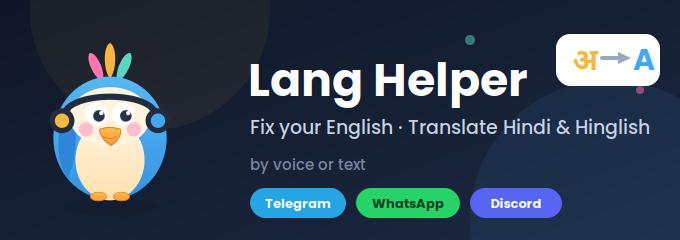
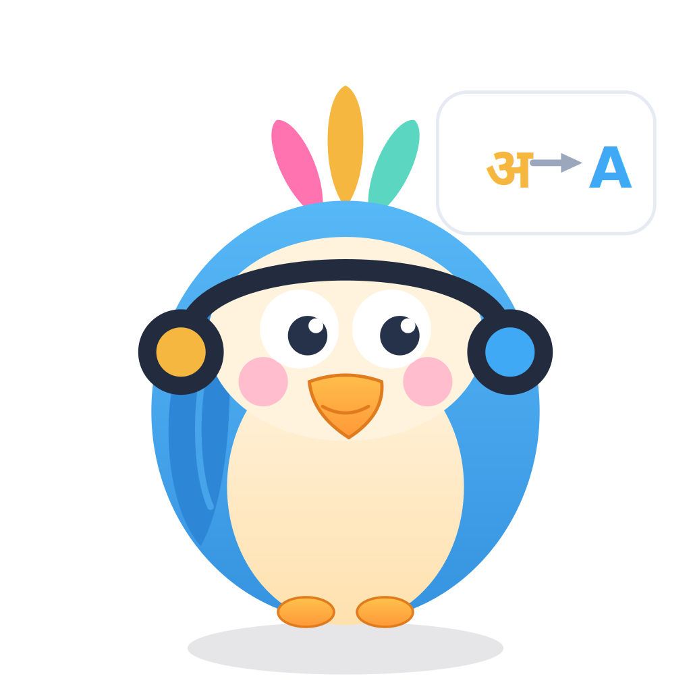
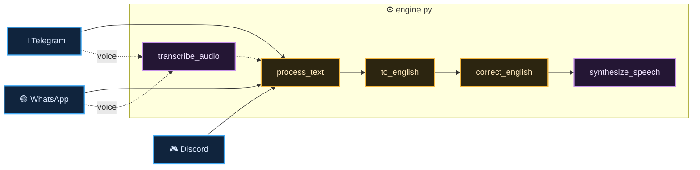

<div align="center">



<br/><br/>


### Fix your English &nbsp;·&nbsp; Translate Hindi &amp; Hinglish &nbsp;·&nbsp; by text *or* voice

</div>

---

<table>
<tr>
<td width="170" align="center">

</td>
<td>

### 🦜 &nbsp;Meet Tota

<b>Tota</b> (Hindi for <i>parrot</i>) is your multilingual sidekick. Send a message or a voice note in <b>English</b>, <b>Hindi</b>, or <b>Hinglish</b> — Tota replies with clean, corrected English. Just like a parrot, it listens, understands, and speaks it back the right way.

One brain. Three chat apps. Text and voice.

</td>
</tr>
</table>

---

## ✨ What it does

<table>
<tr>
<td width="50%" valign="top">

### 📝 Corrects English
Fixes grammar, spelling, and awkward phrasing — returns natural, polished text.

### 🔁 Translates to English
Hindi, **Hinglish** (Roman script), or English all come back as clean English.

</td>
<td width="50%" valign="top">

### 🎙️ Speaks &amp; listens
Send a voice note — Tota transcribes it, processes it, and **replies with a voice note** of its own.

### 🧩 One engine, everywhere
All language logic lives in a single platform-agnostic core shared across every app.

</td>
</tr>
</table>

### 💬 See it in action

| You send | 🦜 Tota replies |
| :-- | :-- |
| `kaisa hai tu` &nbsp;<sub>(Hindi)</sub> | How are you? |
| `mujhe ye movie bahut pasand aayi` &nbsp;<sub>(Hinglish)</sub> | I really liked this movie. |
| `he go to school everyday` | He goes to school every day. |
| 🎙️ &nbsp;a voice note | 🔊 &nbsp;a corrected voice note |

---

## 📲 Live on three platforms

<div align="center">

|  |  |  |
| :--: | :--: | :--: |
| Text **+ voice** | Text **+ voice** | Text, on `@mention` |
| webhook | webhook + Twilio | gateway bot |

</div>

---

## 🔧 How it works

The whole project follows one rule: **the engine never imports a chat platform.** Each app is a thin *adapter* that speaks its platform's language; they all call the same *engine*. That's why voice and text share one pipeline — and why adding a new app is "just another adapter."



**The flow:** a message (or transcribed voice) enters `process_text` → `to_english` auto-detects and converts Hindi / Hinglish / English to English → `correct_english` polishes the grammar → the result is sent back as text, or spoken back as voice.

---

## 🛠 Tech stack

<div align="center">


</div>

| Job | Tool | Notes |
| :-- | :-- | :-- |
| 🤖 &nbsp;Telegram | **python-telegram-bot** | webhook mode |
| 🟢 &nbsp;WhatsApp | **Flask + Twilio** | webhook, media over URL |
| 🎮 &nbsp;Discord | **discord.py** | gateway, `@mention` triggered |
| 🌍 &nbsp;Translation | **deep-translator** (Google) | auto-detect → English · no key |
| ✍️ &nbsp;Grammar | **Groq** (Llama 3.3 70B) | hosted, fast |
| 🎧 &nbsp;Speech → text | **Gladia** | hosted transcription |
| 🗣️ &nbsp;Text → speech | **gTTS** | Google Text-to-Speech |

> 💡 No local ML models, no system dependencies — every bot is a lightweight script, so hosting stays cheap and simple.

---

## 📁 Project structure

```
Lang_Helper/
├── 🧠 engine.py          # the brain — language logic, platform-agnostic
├── 📨 telegram_bot.py    # adapter — Telegram (text + voice)
├── 🟢 whatsapp_bot.py    # adapter — WhatsApp via Twilio (text + voice)
├── 🎮 discord_bot.py     # adapter — Discord (text, @mention)
├── 📦 requirements.txt
├── 🔐 .env.example       # secrets — never committed
└── 🙈 .gitignore
```

---

## 🚀 Run it yourself

<details>
<summary><b>① &nbsp;Clone &amp; install</b></summary>

<br/>

```bash
git clone https://github.com/Parth-KG/lang-helper-bot.git
cd lang-helper-bot
pip install -r requirements.txt
```

</details>

<details>
<summary><b>② &nbsp;Add your keys</b></summary>

<br/>

Create a `.env` in the project root (it's git-ignored):

```env
# core
GROQ_API_KEY=your_groq_key
GLADIA_API_KEY=your_gladia_key

# telegram
TELEGRAM_TOKEN=your_botfather_token
WEBHOOK_URL=https://your-app.onrender.com

# whatsapp (twilio)
TWILIO_ACCOUNT_SID=your_sid
TWILIO_AUTH_TOKEN=your_token
PUBLIC_URL=https://your-public-url

# discord
DISCORD_TOKEN=your_discord_token
```

| Key | For | From |
| :-- | :-- | :-- |
| `GROQ_API_KEY` | grammar | [console.groq.com](https://console.groq.com) |
| `GLADIA_API_KEY` | transcription | [gladia.io](https://www.gladia.io) |
| `TELEGRAM_TOKEN` | Telegram | [@BotFather](https://t.me/BotFather) |
| `TWILIO_*` | WhatsApp | [twilio.com](https://www.twilio.com) |
| `DISCORD_TOKEN` | Discord | [Developer Portal](https://discord.com/developers/applications) |

Translation needs no key.

</details>

<details>
<summary><b>③ &nbsp;Launch a bot</b></summary>

<br/>

Each adapter runs on its own:

```bash
python telegram_bot.py     # Telegram
python whatsapp_bot.py     # WhatsApp (Flask, port 5001)
python discord_bot.py      # Discord
```

</details>

---

## ☁️ Deployment

All three run in the cloud:

- **Telegram** — webhook web service; registers itself with Telegram on startup.
- **WhatsApp** — Flask webhook web service; Twilio posts incoming messages and fetches voice replies over a public URL.
- **Discord** — a gateway worker; it connects *out* to Discord, so no public URL needed.

Secrets live in the host's environment variables, never in the repo.

---

## 🧠 Design philosophy

```
                    engine.py  ·  the brain
                  /      |       \       
       telegram_bot  whatsapp_bot  discord_bot   
          webhook    Flask+Twilio    gateway    
```

Everything platform-specific — downloads, replies, webhooks — lives in its adapter. Everything about *language* lives in `engine.py` and takes plain strings in and out. Add a platform, write one adapter, reuse the whole brain. Nothing gets rewritten.

---

<div align="center">


<sub><b>Tota</b> · translate · transcribe · synthesize · correct</sub>

<sub>MIT Licensed</sub>

</div>
